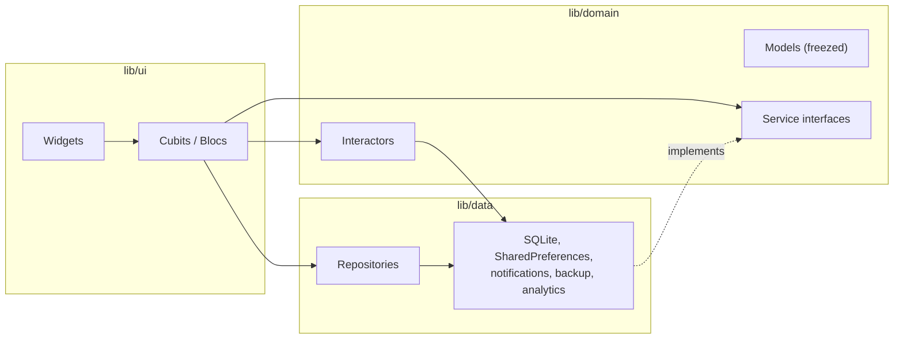

# Life Calendar

[](https://github.com/Strafe0/life_calendar2/actions/workflows/ci.yml)


Your whole life on one screen, one square per week. Life Calendar turns your
birth date and expected lifespan into a grid of weeks: past, current and
future. Open any week to rate it, plan goals, log events, attach photos and
write a short summary.

The app is live on Google Play (version 3.0.0). There is no account or server:
weeks, notes and photos are stored only on the device.

<a href="https://play.google.com/store/apps/details?id=com.vgol.life_calendar"></a>

<!-- Screenshots: add store screenshots here (e.g. docs/screenshots/*.png in a 4-column table). -->

## Features

- **Life grid.** Each row is one year (52 or 53 weeks), 3,200 to 5,300 weeks
  in total depending on the lifespan (60 to 100 years). Pinch to zoom, tap a
  square to open the week.
- **Week page.** Rating (good, normal, bad), goals with checkboxes, dated
  events, photos and a weekly summary.
- **Gestures.** Pull up to jump to the current week, pull down to search a week
  by date, swipe from the left edge to open the menu.
- **Home screen widget** on Android and iOS with life progress and the current
  week's goals and events.
- **Weekly reminder.** An optional Sunday evening notification that respects
  the device time zone.
- **Backup and restore.** Export all data (database, settings, photos) to a ZIP
  archive and import it back. A failed import rolls back to the previous state.
- **Editable lifespan.** The calendar grows or shrinks; the app warns before
  removing weeks that already have data.
- Light and dark themes, English and Russian localization, onboarding for new
  users and a short "what's new" for those upgrading.

## Architecture

The code is split into three layers. Screens hold their state in Cubits and
Blocs, which talk to repositories and services through interfaces. All
dependencies are wired once in [`calendar_app.dart`](lib/calendar_app.dart)
with `RepositoryProvider` and passed in through constructors, so there is no
service locator and every Cubit can be tested with fakes.



```
lib/
├── core/      navigation, localization, logger, extensions, time source
├── data/      repositories, database, preferences, notifications, backup, analytics
├── domain/    models, service interfaces, interactors
├── ui/        feature screens: calendar, week, registration, onboarding, splash
└── utils/     calendar generation, layout and week search
```

### Decisions

- **Bloc library.** Cubits for screens where state changes are plain method
  calls, a Bloc for the user session, which receives events from several
  screens. Screen-level Cubits are scoped to their route or screen and closed
  with it.
- **Errors as values.** Repositories return a sealed `Result<T>` (`Ok` or
  `ResultError`) instead of throwing, so every Cubit handles failure with an
  exhaustive `switch`.
- **SQLite via sqflite.** One row per week, with goals, events and photos in
  JSON columns. Schema migrations (v1 to v4) run cumulatively, so restoring a
  backup made by an old version still upgrades correctly. Parsing thousands of
  rows runs in a background isolate with `compute`.
- **One `CustomPainter` for the grid.** Thousands of squares are drawn by a
  single painter instead of thousands of widgets. `InteractiveViewer` handles
  zoom, and taps are mapped to weeks by precomputed rectangles.
- **Backup as strategies.** The database, preferences and photo library each
  implement a `BackupStrategy`. The backup service packs them into one archive
  and keeps a rollback snapshot while restoring.
- **Injectable clock.** Calendar generation and age calculation take a
  `TimeSource` instead of calling `DateTime.now()`, which keeps them
  deterministic in tests.
- **go_router** for declarative routes, including a parameterized route for
  each week (`/calendar/week/:id`).
- **Android flavors** for the production app and test builds that install side
  by side.
- **Strict analysis.** `flutter_lints` plus 62 additional lint rules.

## Testing

- Week search is checked against the calendar generator for every date of a
  60-year calendar, for birthdays on each day of the week and on February 29.
- The photo storage migration (database v3 to v4) is tested on in-memory
  SQLite through `sqflite_common_ffi`.
- CI runs formatting, a generated-code freshness check, static analysis, tests
  and an Android build on every push and pull request.

```bash
fvm flutter test
```

## Tech stack

| Area | Packages |
| --- | --- |
| State management | flutter_bloc, equatable |
| Navigation | go_router |
| Models and serialization | freezed, json_serializable |
| Storage | sqflite, shared_preferences, path_provider |
| Platform features | home_widget, flutter_local_notifications, image_picker, file_picker, flutter_archive |
| Monitoring | Firebase Crashlytics, Firebase Analytics |
| Localization | flutter_localizations, intl (ARB files) |
| Tooling | fvm, build_runner, GitHub Actions |

## Getting started

The Flutter version is pinned in [`.fvmrc`](.fvmrc).

```bash
fvm install
fvm flutter pub get

# Android (test flavor, installs next to the store version)
fvm flutter run --flavor lifeCalendarTest

# iOS
fvm flutter run
```

After changing models, regenerate code:

```bash
fvm dart run build_runner build --delete-conflicting-outputs
```

## License

All rights reserved. The source code is published for portfolio review only;
see [LICENSE](LICENSE).

Built by Valeriy Golyshev.
